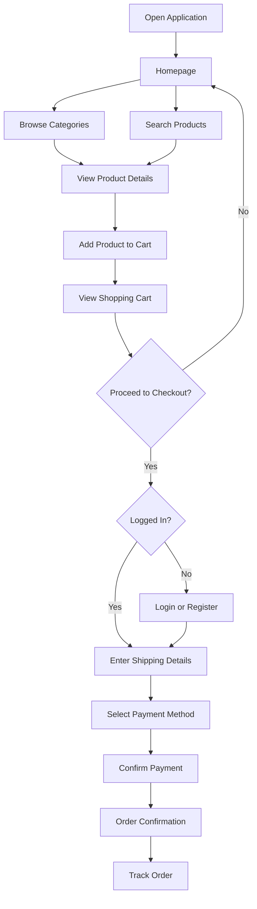

# Cartly - E-Commerce Web Application UI/UX Design

## Course Information

**Course Code:** INSY 8313  
**Course Name:** Management Information System (MIS)  
**Instructor:** Eric Maniraguha  

---

# Group Members

| Name | Registration Number |
|------|---------------------|
| Student 1 | MUGISHA Yves |
| Student 2 | NDAMUKUNDA GASANA Elie |

---

# Selected Application/System

**Application Type:** E-Commerce Web Application

**Application Name:** Cartly

Cartly is an online shopping platform designed to provide users with a simple, fast, and user-friendly experience for discovering products, managing purchases, completing payments, and tracking orders.

---

# 1. Problem Statement

Many customers face challenges when shopping online due to complicated website navigation, unclear product information, lengthy checkout processes, and poor user experiences on some existing e-commerce platforms. These problems make it difficult for users to quickly find products, complete purchases, and manage their orders efficiently.

Cartly aims to solve these challenges by providing a clean, responsive, and user-centered e-commerce platform that allows users to easily browse products, search for items, add products to a cart, complete secure payments, and track their orders.

The main target users are students, working professionals, families, and individuals who prefer convenient online shopping solutions. The system is important because it saves users time, improves accessibility, and provides a smoother shopping experience through modern UI/UX design principles.

---

# 2. User Persona

## Persona: Alice Mukamana

**Age:** 24 years old

**Occupation:** University Student

**Location:** Kigali, Rwanda

## Background

Alice is a university student who frequently purchases clothing, electronics accessories, and personal items online. She prefers shopping online because she has a busy academic schedule and wants to save time.

## Goals

- Find products quickly and easily.
- Compare different products before purchasing.
- Complete purchases without complicated steps.
- Track delivery status after ordering.

## Challenges / Frustrations

- Websites with confusing navigation.
- Too many unnecessary steps during checkout.
- Difficulty finding reliable product information.
- Poor mobile shopping experiences.

# 3. User Flow Diagram

The Cartly user flow demonstrates the customer's journey from exploring products to completing a purchase. Users can browse products without creating an account and are prompted to log in or register when necessary, such as during checkout.

---

# 4. Wireframes (Low-Fidelity Design)

The wireframes represent the basic structure and layout of the Cartly application before applying colors, images, and detailed visual elements. The purpose of the wireframes is to define the user experience, screen arrangement, and navigation flow.

## Designed Wireframe Screens

### 1. Homepage Wireframe

**Purpose:**
Provide users with an overview of available products and categories.

**Main Components:**
- Navigation bar
- Search bar
- Product categories
- Featured products section
- Product cards
- Bottom navigation

---

### 2. Product Details Wireframe

**Purpose:**
Allow users to view detailed information about a selected product.

**Main Components:**
- Product image placeholder
- Product name
- Product description
- Price
- Product rating
- Add to Cart button

---

### 3. Shopping Cart Wireframe

**Purpose:**
Allow users to review and manage selected products before checkout.

**Main Components:**
- Selected product list
- Product quantity controls
- Remove item option
- Total price
- Checkout button

---

### 4. Checkout Wireframe

**Purpose:**
Provide a simple process for completing an order.

**Main Components:**
- Delivery information
- Payment method selection
- Order summary
- Confirm order button

---

# 5. High-Fidelity UI Design

The high-fidelity design transforms the wireframes into a complete visual interface by applying colors, typography, images, icons, spacing, and design components.

The design follows modern UI/UX principles including consistency, simplicity, accessibility, and responsiveness.

## Designed High-Fidelity Screens

### 1. Splash Screen

**Description:**
Introduces the Cartly brand and creates the first impression for users.

Features:
- Application logo
- Brand identity
- Loading interaction

---

### 2. Homepage

**Description:**
The main screen where users discover products.

Features:
- Search functionality
- Product categories
- Featured products
- Recommended items
- Navigation menu

---

### 3. Product Details Screen

**Description:**
Displays complete information about a selected product.

Features:
- Product images
- Product description
- Price
- Ratings
- Add to Cart action

---

### 4. Shopping Cart Screen

**Description:**
Allows users to review products before purchase.

Features:
- Product summary
- Quantity adjustment
- Total calculation
- Checkout button

---

### 5. Checkout Screen

**Description:**
Allows users to complete their purchase.

Features:
- Shipping details
- Payment selection
- Order summary
- Confirmation button

---

### 6. Order Confirmation Screen

**Description:**
Confirms successful purchase completion.

Features:
- Order number
- Purchase summary
- Delivery tracking option

---

# 6. Interactive Figma Prototype

The Cartly prototype connects all designed screens to simulate a real application experience.

## Implemented Interactions

- Splash screen navigation to homepage.
- Product browsing interactions.
- Product details navigation.
- Add-to-cart interaction.
- Cart management.
- Checkout navigation.
- Payment confirmation flow.
- Order tracking navigation.

The prototype demonstrates how users interact with the system from discovering products to completing an order.

---

# 7. Features Implemented

The Cartly application prototype includes the following features:

## User Features

- Browse products without requiring login.
- Search for products.
- View product details.
- Add products to cart.
- Manage cart items.
- Complete checkout process.
- Track orders.

## Design Features

- Responsive interface design.
- Consistent color system.
- Reusable UI components.
- Clear navigation structure.
- Accessible layout.

---

# 8. Accessibility Considerations

Accessibility was considered throughout the design process to ensure that the application is easy to use for different users.

## Implemented Accessibility Practices

### Readable Typography
- Used appropriate font sizes.
- Maintained clear text hierarchy.
- Avoided overly small text.

### Color Contrast
- Ensured sufficient contrast between text and backgrounds.
- Used colors that improve readability.

### Navigation
- Created clear navigation paths.
- Used recognizable icons.
- Maintained consistent button placement.

### Layout
- Applied proper spacing between elements.
- Avoided cluttered screens.
- Designed responsive layouts for different screen sizes.

---

# 9. Challenges Faced

During the design process, the team encountered several challenges:

- Identifying the most important e-commerce features to include.
- Designing a simple but complete user journey.
- Maintaining consistency across multiple screens.
- Creating a responsive design that works across different devices.
- Balancing visual creativity with usability.

The team addressed these challenges through user research, design iteration, and applying UI/UX principles.

---

# 10. Conclusion

The Cartly E-Commerce application prototype demonstrates how user-centered design can improve online shopping experiences. The project focuses on solving common e-commerce usability problems by providing simple navigation, clear product information, and an efficient checkout process.

Through this project, the team applied important UI/UX concepts including user research, persona creation, wireframing, interface design, accessibility, and interactive prototyping using Figma.

The final prototype provides a modern, accessible, and user-friendly shopping experience that meets the needs of online customers.
